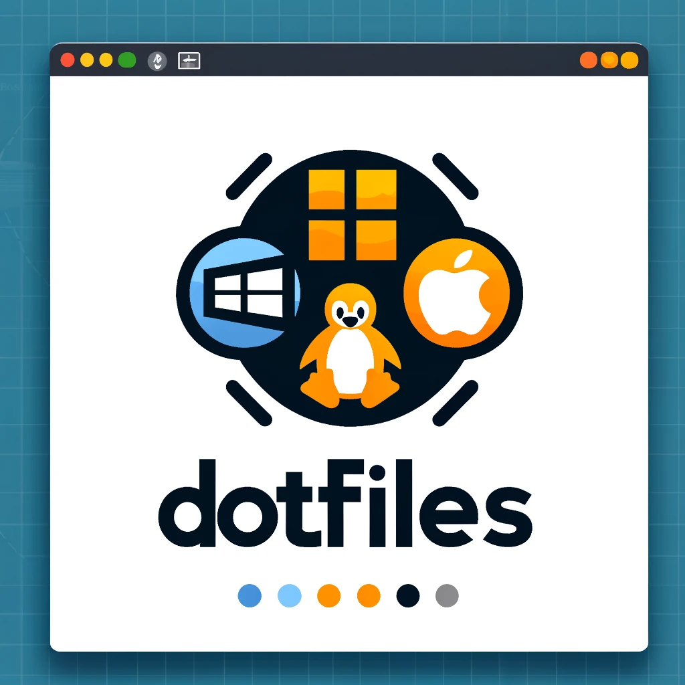

# Dotfiles


<p align="center">
  
</p>

## Objective

The goal of this repository is to facilitate the rapid setup and synchronization of development environments across multiple machines. It also allows customization and easy management of common system configurations.

## Deposit structure

The deposit is organized as follows:

- `commons/`: Common configurations for all environments.
- `mac/`: Configurations for MacOs.
- `ubuntu/`: Configurations for Ubuntu/WSL.

## How to use this repository

To use this repository, clone it to your local machine, then follow the instructions specific to each folder to configure the relevant software.

The only dependency is git.

### Clone the repository

```bash
git clone git@github.com:thomas-leroy/dotfiles.git
cd dotfiles
```

### Facility

#### For Windows only

Use this command in **Elevated rights** PowerShell :

```powershell
.\windows\install.ps1
```

Once done and once you've installed your distribution on wsl, you can clone back this project on WSL and follow the next sections.

#### Installation

To start the installation:

```bash
make install
```

This will install different tools depending the environnement :

| Ubuntu                  | Mac                     |
|-------------------------|-------------------------|
| -                       | Warp terminal           |
| -                       | Homebrew                |
| Zsh & Oh My Zsh         | Zsh & Oh My Zsh         |
| Theme (Powerlevel10k)   | Theme (Powerlevel10k)   |
| node.js (via nvm)       | node.js (via nvm)       |
| Docker & Docker Compose | Docker & Docker Compose |
| Visual Studio Code      | Visual Studio Code      |

Once the script is finished, **it is needed to exit and open a new terminal session**.

### Initializing the dev environment

To initialize git and node, run the following command:

```bash
make init
```

This script will init git env by:

- Setting up your git email address & name globally
- [OPTIONAL] Generate GPG key
- Setting up your git GPG key globally
- Generating a new SSH key
- Display SSH public key and GPG public key to add it to your [Github configuration](https://github.com/settings/keys)

Next, your node environnement will be setup:

- Setting up directories to work on
- Update node.js
- Install http-server globally

### Update repo

```bash
make update
```

For now, this command is an alias of `git pull origin main`.

### Save Visual Studio Code configuration

```bash
make export-vscode
```

This command will save you Visual Studio Code configuration :

- List of installed extensions
- `settings.json`
- `keybindings.json`

The shortcuts, settings and installed extension will be saved in the `./vscode/resources` directory.

All parameters can be imported using the command:

```bash
make import-vscode
```

This command will:

- Install the list of extensions on top of existing extensions (if any)
- Restore `settings.json`
- Restore `keybindings.json`

## Known limitations

List of issues that will be handled soon:

- WSL import of Visual Studio Code is not working yet for shortcut & keybindings.
- Still room for improvement in error management.

## Personalization

You are encouraged to fork this repository and modify the configurations as needed. You can also contribute to this repository by proposing improvements or new configurations.

## License

This repository is distributed under the MIT License. You are free to use, modify and redistribute it under the terms of this license.

## Contribution

Contributions to this repository are welcome. If you want to improve or add new configurations, please submit a pull request.

## Support

If you have any questions or encounter issues with this repository, please open an issue in this GitHub repository.